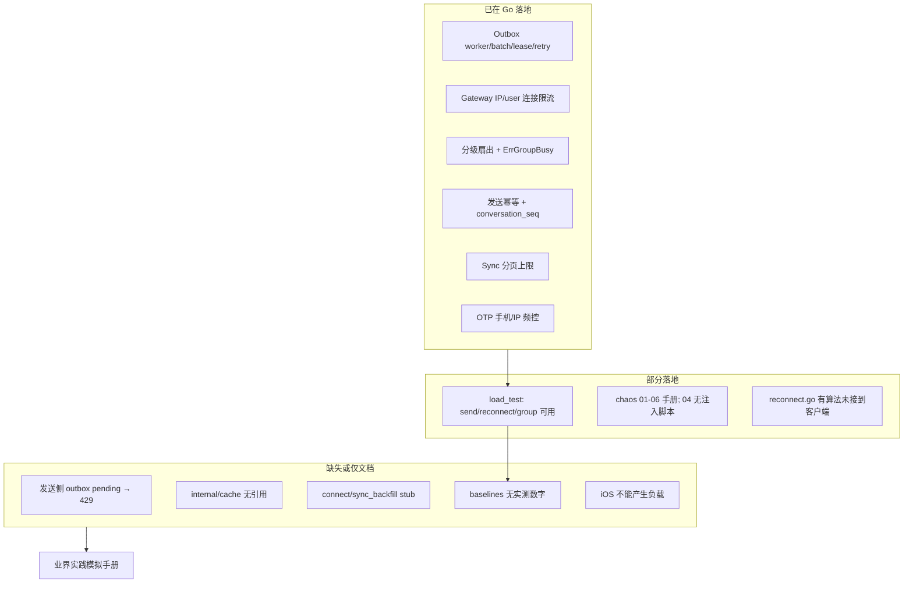

# 高性能 / 高负载 IM 验证推进计划

## 现状结论（只读审计）

**目标定位（Spec 01）**：学习型容量假设（峰值连接 5万–20万、写入 1千–1万 msg/s），不是承诺生产 SLA。本地单机 **无法** 实证该量级；能做的是：把「放大因子 / 单写点 / 降级语义」用可控流量打出来并对照指标。

| 问题族 | 业界常见解法 | 本仓代码 | 能否今天模拟 |
|--------|--------------|----------|--------------|
| 写扩散 / 热点群 | 分级扇出、读扩散、限流 | [`fanout/service.go`](livechat-server/internal/fanout/service.go) 已有 | 是（`group_fanout` + chaos 06；成员数建议提到 ~50–200） |
| 重连风暴 | 退避+jitter、接入限流 | [`ratelimit.go`](livechat-server/internal/gateway/ratelimit.go) 已有；退避在服务端库、iOS 未接 | 部分（Python reconnect；真 protobuf 握手仍弱） |
| Outbox 积压 | 消费并行、生产者背压 | Consumer 有；**无** HTTP 429 反压 | 可观察（chaos 02）；解法待补 |
| 序号单写点 | 分片 seq / 批量预分配 | `CACHE 1` SEQUENCE 串行 | 可压测同一会话高写观察延迟 |
| 缓存击穿 | 空值/互斥/抖动 TTL | [`internal/cache`](livechat-server/internal/cache) **未被业务引用** | 暂不能在热路径验证 |
| 多端一致 | 每设备 cursor + sync | sync API 已有 | 正确性可测；`sync_backfill` 场景仍 stub |

**iOS 角色（双重定位）**：[`ios/`](ios/) 仍是 stub Repository。

1. **负载源**：验证服务端容量时 **负载源 = Python `load_test/`**，iOS 不负责打出千级 QPS。
2. **被测的高负载客户端**：iOS 端本身必须能在「大量历史消息、突发投递、弱网抖动、后台唤醒、写风暴」下不卡 UI、不丢消息、不爆内存。这一层是本轮要 **先落地整体方案与坑点**（阶段 D-1，见下），实现由用户后续开票。

---

## 下一步执行策略（已选定默认）

**默认路径**：先「可模拟、可度量」→ 再补 1 个最有教学价值的服务端解法（发送侧背压）→ 再推进 iOS 0022–0025 做多端正确性闭环。  
不追求本地打满 Spec 01 的 20万连接 / 1万 msg/s。

### 阶段 A — 业界实践模拟手册（文档先行）

新建一份实践目录（建议路径 [`docs/load-practice/`](docs/load-practice/) 或扩写 [`docs/engineering-problems/15-high-concurrency-failure-modes.md`](docs/engineering-problems/15-high-concurrency-failure-modes.md) + [`load_test/baselines/`](load_test/baselines/)）：

对每个问题写统一模板：

1. **问题是什么**（放大因子公式）  
2. **业界常见方案**（WhatsApp 写扩散上限 / Telegram 读扩散 / 令牌桶背压 / 连接 shed）  
3. **本仓现状**（Implemented / Partial / Missing + 代码锚点）  
4. **如何模拟**（精确命令：`load_test` 参数 + `scripts/chaos/*`）  
5. **观察什么**（`/metrics`、日志关键字、`hot_group:*`、pending）  
6. **通过标准**（学习型：行为符合预期，而非打满 Spec 数字）

覆盖矩阵（最少 8 条）：写高峰、热点群、重连风暴、Outbox 背压、Redis 降级、DB 暂停、Gateway kill、离线 sync 积压。

### 阶段 B — 让模拟真的能跑（压测/演练硬化）

优先改这些，使手册可执行：

1. **补齐 stub**：[`load_test/scenarios/connect.py`](load_test/scenarios/connect.py)（真 WS，至少完成 upgrade；protobuf 握手按最小可用补）、[`sync_backfill.py`](load_test/scenarios/sync_backfill.py)（造 cursor 落后 + 拉 `/v1/sync/events`）  
2. **加固** [`send_message.py`](load_test/scenarios/send_message.py)（去掉脆弱 `psql`，改用已登录用户 + 建群/`0026` 就绪后的 direct API）  
3. **`group_fanout`**：支持可配置成员数（默认抬到可触发热点阈值），对照 `ErrGroupBusy` / `hot group event dropped`  
4. **跑一轮本机基线**，把 P50/P95/错误率写入 [`load_test/baselines/`](load_test/baselines/)（替换纯差距说明）  
5. **chaos 04**：补一个最小 push 延迟/失败注入（env 开关或 mock provider sleep），与手册对齐  

### 阶段 C — 补一个「解法」垂直切片（服务端）

在模拟能稳定打出 **Outbox pending 上涨而 send 仍 200** 之后，实现：

- **发送侧背压**：`outbox_pending`（或 lag）超阈 → `POST /v1/messages/send` 返回 429 + Retry-After  
- 更新手册：同一 chaos 02 场景下，对比「无背压 vs 有背压」的 pending 曲线与客户端重试行为  
- 可选后续（不阻塞主线）：幂等窗口缓存；把 `internal/cache` 接到一条真实热路径（如群成员列表）再压测

### 阶段 D-1 — iOS 高负载 / 弱网 客户端方案与坑点（文档先行，本轮重点）

**产出物**：新增 [`docs/ios-high-load-client.md`](docs/ios-high-load-client.md)（或并入 [`docs/iOS多端接入评估与实现.md`](docs/iOS多端接入评估与实现.md)），沿用工程问题库模板：问题 → 业界方案 → 本仓落点（对应 Spec 13 / `ios/` 协议）→ 如何本地复现 → 坑点。不写实现代码，用户后续开票。

覆盖的 iOS 高负载子问题与方案：

| 子问题 | 触发场景 | 落地方案（对应 Spec 13） | 关键坑点 |
|--------|----------|--------------------------|----------|
| 突发投递刷新风暴 | WS 短时间收到成百条 `MESSAGE_DELIVERY` | 事件先入队批量落库，UI 用 GRDB `ValueObservation` 去抖（合并 16–33ms 窗口），不每条 `reloadData` | 每条消息触发一次 UI diff → 主线程卡顿；`ValueObservation` 未加节流导致 observation 风暴 |
| 大会话滚动 | 会话有数万条历史 | 分页 `fromSeq` 游标 + `List`/`UITableView` 懒加载；本地按 `conversation_seq` 索引查询 | 一次性 `SELECT *`；SwiftUI `ForEach` 全量渲染；缺 `(conversation_id, conversation_seq)` 复合索引（骨架已建，勿删） |
| 发送队列写风暴 | 用户狂发 / 失败重试堆积 | `actor MessageSendExecutor`（Spec 13 §5.2）单 actor 串行 + 有界队列 + 幂等 `client_message_id` | 多入口并发写同一行；无界队列吃内存；重试无退避形成本地风暴 |
| GRDB 写并发 | sync 批量落库 + 发送 + 已读推进同时写 | 单一 `DatabaseQueue` 串行写 + 读写分离（WAL）；写操作批量事务 | 多 writer 抢锁；逐条事务 fsync 拖慢；主线程同步查询 |
| 弱网 / 断网 | 地铁、切网、丢包 | 离线优先：先写本地 `queued`；`NWPathMonitor` 感知；恢复后队列续跑（Spec 13 §8.3） | 网络回调抖动反复触发重连；`sending` 卡死无超时；乐观 UI 与失败态不收敛 |
| 重连风暴（客户端侧） | App 批量回前台 / 服务端踢连 | 指数退避 + jitter（移植服务端 `reconnect.go` 语义）；单飞（single-flight）连接 | 立即重连打穿网关限流（429/4029）；多个 Task 并发建连；未按 `should_reconnect` 区分 |
| 后台唤醒预算 | Silent Push / BGTask | 后台只做「触发增量 sync」不做重活；心跳降频至 120s（Spec 13 §8.2）；限时完成 | 后台超时被系统杀；把 push payload 当消息真相源；后台狂 sync 耗电 |
| sync 追赶洪流 | 离线久了 `has_more` 连拉 | 分批 apply + 让出主线程 + cursor 单调推进；首屏优先可见会话 | 递归 sync 无让步阻塞；cursor 提前推进导致丢事件；全量 apply 卡首屏 |
| 内存 / 图片 | 大量缩略图滚动 | 缩略图优先 + 磁盘/内存双层缓存 + 取消离屏加载 | 原图直载 OOM；`Data(contentsOf:)` 阻塞；无取消导致积压 |
| 时钟与顺序 | 多端乱序到达 | 一律按 `conversation_seq` 排序渲染，不用本地时间（与服务端一致） | 用 `created_at` 排序造成乱序；`server_message_id` 去重缺失导致重复气泡 |

**如何在本地复现 iOS 高负载**（供后续票参考，不含实现）：

- 用 Python `load_test` 向某会话灌 1k+ 条消息 → iOS 冷启动做首屏 sync，用 Instruments（Time Profiler / Allocations / Core Animation）观察主线程与内存
- `group_fanout` 打热点群，同时 iOS 在该群前台，观察投递刷新是否卡帧
- 用 Network Link Conditioner（100% loss / high latency）验证弱网发送队列与重连退避

### 阶段 D-2 — iOS 作为验证前端（正确性，非容量）

沿已发布票执行，与负载手册解耦：

| 顺序 | Ticket | 在验证体系中的作用 |
|------|--------|-------------------|
| 1 | [0022](issues/0022-ios-auth-otp-keychain-login-ui.md) | 多 `device_id` 登录 |
| 2 | [0026](issues/0026-server-direct-conversation-api.md)（可并行） | 去掉建群 workaround，方便双端私聊 |
| 3 | [0023](issues/0023-ios-local-first-send-grdb-http.md)–[0025](issues/0025-ios-websocket-realtime-delivery.md) | 本地优先 + sync + 实时；在 Python 打负载时用 2 台模拟器做「消息可达/顺序」抽检 |
| 后置 | 0027 / 0028 | 媒体与推送，不进入第一轮高负载门禁 |

> D-1 的高负载要求应作为 **横切验收项** 补进 0023/0024/0025（例如「首屏 1k 条不卡帧」「弱网发送不丢」），由用户后续开票时纳入。

验收口令（学习型）：

- Python：`--quick` 五场景绿 + 一份填数基线 + 至少 2 个 chaos 复盘  
- iOS 正确性：双端收发文本成功（WS 或 sync）  
- iOS 高负载（D-1 方案落地后）：首屏大会话不卡主线程、弱网发送不丢、突发投递不掉帧  
- **不**把「打满 Spec 01 数字」列为门禁  

### 阶段 E — 收口

- 打 Phase 3/验证相关 annotated tag（例如在手册+基线+背压就绪后），并在 [`CLAUDE.md`](CLAUDE.md) / 架构总览中写明「容量验证 = 本地放大因子实证，非 20万连接」  
- 视需要把阶段 A–C 拆成 `issues/0029+`（实践手册、压测硬化、send backpressure），与 0022–0028 并行不互相阻塞

---

## 明确不做（本轮）

- 用 iOS 模拟器集群打容量  
- 本地宣称达到 Spec 01 峰值连接/写入  
- 一次性实现缓存全链路、多 Gateway 生产 failover、真 APNs 压测
