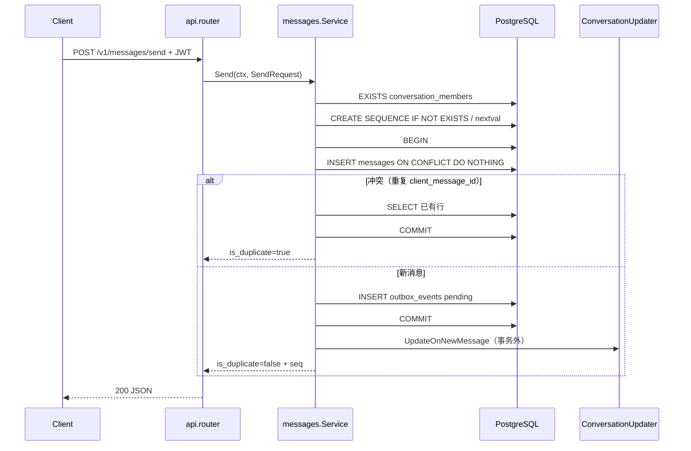

# 01 — `internal/messages`：发送写路径

## 一句话职责

在 **message-service** 内，把「发一条消息」做成：**校验成员 → 分配 `conversation_seq` → 同一事务写入 `messages` + `outbox_events`**；重复发送靠幂等键返回同一结果。

入口 HTTP：`POST /v1/messages/send`（`internal/api/router.go` → `svc.Send`）。

## 文件清单

| 文件 | 内容 |
|------|------|
| [`livechat-server/internal/messages/service.go`](../../livechat-server/internal/messages/service.go) | 唯一实现文件：`Service`、`Send`、`ensureSeq` |

无独立 `repository` 层：SQL 直接写在 `Service` 方法里（学习型、短路径）。

## 调用链



**重要**：HTTP 200 只表示 **Accepted（已持久化）**，不表示对端已收到。投递由 Outbox Consumer → Fanout → Gateway 异步完成（见 [02-outbox](02-outbox.md)、工程问题 06）。

## `Send` 逐步导读

建议打开 `service.go`，按行号区间跟读（行号随版本可能微调，以函数名为准）。

### 1. 结构体与依赖

```go
type Service struct {
    db          *sql.DB
    convUpdater ConversationUpdater  // 可选；会话列表摘要
}
```

- `*sql.DB`：连接池，不是单连接。  
- `ConversationUpdater`：小 **interface**，只声明一个方法——Go 式依赖倒置，便于测试/延后注入（`SetConversationUpdater`）。

### 2. 成员校验

`QueryRowContext` + `EXISTS(...)`。非成员返回哨兵错误 `ErrNotMember`，API 层 `errors.Is` 后映射 **403**。

**Go 点**：`fmt.Errorf("%w: ...", ErrNotMember, ...)` 用 `%w` **包装**错误，上层才能 `errors.Is`。

### 3. 分配 `conversation_seq`（`ensureSeq`）

- 每会话一个 PG SEQUENCE：`conversation_seq_{sanitized_id}`  
- `CREATE SEQUENCE IF NOT EXISTS ... CACHE 1`  
- `SELECT nextval(...)`  

**注意**：`nextval` 在事务外调用；即使后面 INSERT 因幂等冲突未写入新行，**序号也可能被消耗**（间隙正常）。见 `technical-decisions.md` §2。

`sanitizeSeqName`：把会话 ID 里不安全字符换成 `_`，避免拼进 SQL 标识符时出事。

### 4. 同事务：message + outbox

```text
BeginTx
  INSERT messages ... ON CONFLICT (sender_user_id, client_message_id) DO NOTHING
       RETURNING (xmax = 0) AS is_new
  若 ErrNoRows → 查已有行 → Commit → IsDuplicate=true（不写 outbox）
  若插入成功 → INSERT outbox_events(status=pending) → Commit
Rollback 在 defer（Commit 成功则 Rollback 无害）
```

要点：

| 点 | 含义 |
|----|------|
| 幂等键 | `(sender_user_id, client_message_id)` |
| 冲突时不写 outbox | 避免重复投递事件 |
| `xmax = 0` | Postgres 技巧：判断本语句是否真正插入新行 |
| Outbox payload | JSON：含 `server_message_id`、`conversation_seq`、`trace_id` 等，供 Consumer/Fanout 使用 |

### 5. 摘要更新在事务外

`convUpdater.UpdateOnNewMessage` 用 `context.Background()`，失败只打日志。  
取舍：**发送延迟 vs 会话列表强一致**——列表可最终一致，消息本身已安全。

## Go 语言点速查（本包）

| 概念 | 本包例子 |
|------|----------|
| `context.Context` | 所有 DB 调用带 `ctx` |
| `database/sql` | `BeginTx` / `QueryRowContext` / `ExecContext` |
| `defer tx.Rollback()` | 简化错误路径 |
| interface | `ConversationUpdater` |
| 哨兵错误 | `var ErrNotMember = fmt.Errorf(...)` |
| JSON | `encoding/json` 编 outbox payload、解 text preview |

## 建议动手

1. 读 `api/router.go` 里构造 `SendRequest` 的字段从哪来（JWT 的 user/device、body 的 `client_message_id`）。  
2. 同一 `client_message_id` 连发两次，对比响应 `is_duplicate` 与 DB 中 `outbox_events` 行数。  
3. 对照工程问题 [01-message-durability-outbox](../engineering-problems/01-message-durability-outbox.md)。

## 相关文档

- [`technical-decisions.md`](../../livechat-server/docs/technical-decisions.md) §1–§2  
- Spec 04（发送主链路与 Outbox）  
- 下一篇：[02-outbox](02-outbox.md)  
