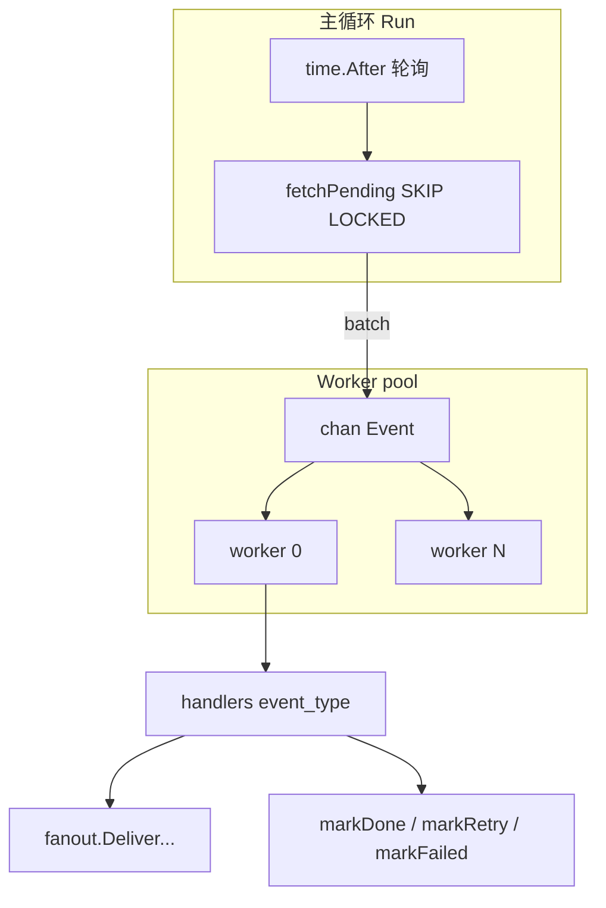

# 02 — `internal/outbox`：Outbox 消费者

## 一句话职责

在 **outbox-consumer** 进程里，轮询 `outbox_events`，把 `pending` 行 **认领（lease）** 后交给已注册的 `Handler`（通常是 Fanout）；成功标 `done`，失败重试或进 `failed`（死信）。

生产者侧写入见 [01-messages](01-messages.md)；本包**不负责** HTTP 发送。

## 文件清单

| 文件 | 内容 |
|------|------|
| [`consumer.go`](../../livechat-server/internal/outbox/consumer.go) | `Consumer`、轮询、worker、状态机、指标 |
| [`consumer_test.go`](../../livechat-server/internal/outbox/consumer_test.go) | 重试、优雅退出等行为测试 |
| 装配 | [`cmd/outbox-consumer/main.go`](../../livechat-server/cmd/outbox-consumer/main.go) 里 `RegisterHandler` |

## 状态机（行级）

```text
pending ──fetchPending──► processing ──handler OK──► done
                │                │
                │                └──handler err──► pending（retry_count++）
                │                                      │
                │                                      └──≥ MaxRetries──► failed
                │
                └──reapStale：processing 超时 ──► pending（崩溃恢复）
```

（表里也可能出现历史 `retry` 计数口径；认领 SQL 当前认的是 `status = 'pending'`。）

## 运行时结构



### `Run(ctx)`

1. 启动时 `reapStale`（把超时仍停在 `processing` 的行打回 `pending`）  
2. 开 `WorkerCount` 个 goroutine，从 `chan Event` 读  
3. 主循环：`PollInterval`（有活）/ `IdlePollInterval`（空闲）  
4. `ctx` 取消 → `close(chan)` → `WaitGroup` 等 worker 结束（优雅停机）

**Go 点**：

- `go func() { for event := range events { ... } }`：channel + worker pool  
- `context.WithoutCancel(ctx)`：worker 处理中途不被父 cancel 立刻掐断（让 in-flight 跑完）  
- `sync.RWMutex` 保护 `handlers` map  

### `fetchPending`

核心 SQL 模式：

```sql
WITH claimed AS (
  SELECT id FROM outbox_events
  WHERE status = 'pending'
  ORDER BY created_at
  LIMIT $1
  FOR UPDATE SKIP LOCKED   -- 多实例互不抢同一行
),
updated AS (
  UPDATE ... SET status = 'processing' ...
  RETURNING ...
)
SELECT ... FROM updated
```

这是 **DB 当作队列** 的经典写法，P0 故意不用 Kafka/CDC（见 `technical-decisions.md` §3）。

### `processEvent`

1. 按 `event.EventType` 查 `Handler`；没有 handler → 仍 `markDone`（避免堵死队列，并打 Warn）  
2. `handler(ctx, event)`  
3. 失败：指数退避 `backoffDuration`（上限 30s + jitter）→ `markRetry` 把状态设回 `pending`  
4. 超过 `MaxRetries` → `markFailed`  

测试里可通过替换包级 `sleepFn` / `randFloat` 避免真睡——这是可测性小技巧。

### `Metrics`

按 status `COUNT(*)`，并算 pending 最老行的 lag 秒数；挂在 outbox-consumer 的 `/metrics`（约 `:8082`）。

## 与 Fanout 的衔接（装配）

在 `cmd/outbox-consumer/main.go`（示意）：

```go
consumer.RegisterHandler("message_created", func(ctx context.Context, event outbox.Event) error {
    // 解 payload → fanout.Service 写 sync_events、在线投递、可选 Push
})
consumer.RegisterHandler("delivery_acked", ...)
consumer.RegisterHandler("read_receipt", ...)
```

本包只定义：

```go
type Handler func(ctx context.Context, event Event) error
```

**业务语义在 handler 闭包里**，Consumer 保持通用——深模块边界。

## Config 默认量级（学习用）

| 字段 | 典型值 | 含义 |
|------|--------|------|
| `PollInterval` | 100ms | 有积压时轮询 |
| `IdlePollInterval` | 500ms | 空闲降频 |
| `BatchSize` | 100 | 每批认领上限 |
| `WorkerCount` | 4 | 并行处理 |
| `MaxRetries` | 10 | 之后进 failed |
| `LeaseTimeout` | 60s | processing 超时回收 |

## 建议动手

1. 发一条消息后：`SELECT id, status, event_type FROM outbox_events ORDER BY id DESC LIMIT 5;` 看 `pending → processing → done`。  
2. `bash livechat-server/scripts/chaos/outbox-pause.sh` 再发送，观察 pending 上涨；resume 后追平（load-practice 04）。  
3. 读一个 `consumer_test.go` 用例，对照重试/停机行为。

## 相关文档

- [`technical-decisions.md`](../../livechat-server/docs/technical-decisions.md) §3  
- 工程问题 [01](../engineering-problems/01-message-durability-outbox.md)、[15](../engineering-problems/15-high-concurrency-failure-modes.md)  
- 演练：[load-practice/04](../load-practice/04-outbox-backpressure.md)、[chaos/02](../chaos/02-outbox-backpressure.md)  
- 上一篇：[01-messages](01-messages.md)；建议下一包导读：`fanout` 或 `gateway`  
