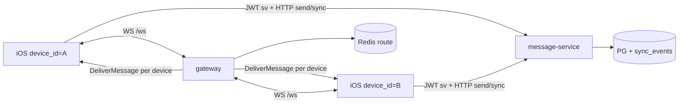

# iOS 多端接入：能力评估与实现路径

结合 [`Specs/13-iOS客户端架构设计.md`](../Specs/13-iOS客户端架构设计.md)、现有 `ios/` 骨架（ticket 0021）与服务端 Phase 1–3，回答两件事：

1. **现在能不能**让几台 iOS 客户端连上并真正「用起来」？  
2. **按 Spec 13 怎么落地**，缺口补什么、建议实现顺序是什么？

API 细节见 [`API参考.md`](./API参考.md)。

---

## 1. 结论（先看这）

| 问题 | 结论 |
|------|------|
| 服务端是否支持多设备同时在线？ | **支持**。按 `device_id` 区分会话；JWT 含 `sv`；Gateway 按 `user+device` 路由；sync cursor 按设备更新 |
| 现有 `ios/` 能否直接聊天？ | **不能**。0021 只交付模块骨架 + GRDB schema + Repository **stub**（`fatalError`），无真实 HTTP/WS/UI |
| 几台模拟器/真机做联调是否可行？ | **服务端侧可行**（本机三进程 + 多 `device_id`）。客户端需先补 Network/WS 与最小 UI，或用 curl / 压测脚本验证链路 |
| 推荐验证路径 | 先用 2 个 `device_id`（同用户或两用户）走 HTTP+WS；再按 Spec 13 填 `ChatInfrastructure` 真实实现 |

**一句话**：后端已经具备「多 iOS 端连接并收发」的协议与状态模型；缺的是 **iOS 把 Spec 13 的 Repository 接到真实 API**，以及 **1:1 建会话 HTTP API**（可用建群 workaround）。

---

## 2. 服务端对「多 iOS」的支持度

### 2.1 已具备



| 能力 | 机制 | 对多端的含义 |
|------|------|----------------|
| 多设备登录 | `verify_code` + 不同 `device_id` | 同一账号多台 iPhone 各持 token |
| 会话吊销 | `session_version` | 一端 revoke 不影响未吊销设备（各自 sv） |
| 实时投递 | Fanout → 在线设备列表 → Gateway | 多端可同时收 MESSAGE_DELIVERY |
| 离线补齐 | 每设备 `sync_cursors` + `GET /v1/sync/events` | Spec 13 SyncExecutor 的服务端对端 |
| 连接保护 | 退避 + IP/user 限流 | 多模拟器狂连不会轻易打挂本机 Gateway |
| 群聊联调 | `POST /v1/groups` + members | **当前最易**的「两人会话」来源 |

### 2.2 缺口与变通

| 缺口 | 影响 | 变通 / 后续 |
|------|------|-------------|
| 无 `POST /v1/conversations` 建 1:1 | 纯私聊 API 不完整 | 建 2 人群；或 SQL 插 `conversations`+`members` |
| iOS Protobuf/WS 未实现 | 收不到实时帧 | 先只做 HTTP sync 轮询验证；或用 Gateway 集成测试作参照 |
| Push 为 mock APNs | 后台唤醒不真实 | 学习阶段可只做前台 WS + sync |
| 媒体本机文件系统 | 真机多机访问同一 `localhost` 存储需注意 | 模拟器共用本机；真机需改 base URL 为 Mac 局域网 IP |
| Repository stub | App 一调即 crash | 按下文 Phase 实现真实 NetworkClient |

### 2.3 与 Spec 13 仓储的映射

| Spec 13 协议 | 服务端入口 | 现状 |
|--------------|------------|------|
| `AuthRepository` | `request_code` / `verify_code` / `refresh` | 服务端就绪；iOS 未接 |
| `MessageRepository.send` | `POST /v1/messages/send` | 就绪 |
| `MessageRepository.getMessages` | `GET .../conversations/{cid}/messages` + 本地 GRDB | 服务端就绪；本地表已有 schema |
| `ConversationRepository` | `GET /v1/conversations` | 就绪 |
| `SyncRepository` | `GET /v1/sync/events` | 就绪 |
| `WebSocketRepository` | `ws://.../ws` + Protobuf | 服务端就绪；iOS 未接 |
| `PushRepository` | `POST /v1/devices/push-token` | 接口就绪；APNs mock |
| `MediaRepository` | `/v1/media/*` | 服务端就绪；iOS 未接 |

---

## 3. 按 Spec 13 如何实现「几台 iOS 能用」

推荐 **垂直切片**，不要先铺满 UI。

### Slice 0 — 环境（当天）

1. 本机：`migrate-up` + message-service / gateway / outbox-consumer  
2. 两台模拟器或一台模拟器 + curl 充当第二端  
3. `baseURL = http://127.0.0.1:8080`，`wsURL = ws://127.0.0.1:8081/ws`  
4. 真机：改成 Mac 的局域网 IP，并确认 ATS / 明文 HTTP 临时例外（仅开发）

### Slice 1 — Auth + 本地登录态（对齐 Spec 13 §8.1 步骤 1–2）

在 `ChatInfrastructure`：

- `HTTPClient`（URLSession）  
- `AuthRepositoryLive`：`request_code` → `verify_code`，Keychain 存 `access_token` / `refresh_token` / `user_id` / `device_id`  
- `device_id`：Keychain 持久化 UUID（每台安装一份 → 天然多端）

验收：两台模拟器同一手机号、不同 device_id，均拿到 JWT；`GET /v1/devices` 看到两台。

### Slice 2 — 本地 DB 为真相源（Spec 13 §4）

骨架已有 `messages` / `conversation_summaries` / `sync_cursors`。补齐：

- GRDB 读写实现（替换 stub）  
- 发送：先 `status=queued` 写库 → HTTP send → 更新为 `accepted` + `server_message_id` / `seq`  
- UI（可先极简 List）只 `ValueObservation` 读本地表

### Slice 3 — SyncExecutor（Spec 13 §5.3）

- 启动 / 回前台：`GET /v1/sync/events?cursor=`  
- `RemoteEventProcessor` 把事件写入本地 DB  
- `has_more` 则继续拉

验收：设备 A 发消息时 B **断 WS**，B 回前台 sync 后本地可见。

### Slice 4 — WebSocketRepository（Spec 13 §6 / §7）

- 使用 SwiftProtobuf 生成与 `proto/ws_frame.proto` 一致的代码（或先手写最小 Handshake + Delivery）  
- 连接后发 `HANDSHAKE_REQ`；收 `MESSAGE_DELIVERY` → 转 `RemoteEvent.messageDelivery`  
- 心跳按 `HandshakeResponse.heartbeat_interval_s`  
- 断线用服务端同款退避（可移植 `ReconnectBackoffDelay` 逻辑）

验收：A、B 同时在线，A 发送后 B **秒级**出现（无需等 sync）。

### Slice 5 — 会话来源（在 1:1 API 补齐前）

- Use case：`CreateGroup(name: "A-B", memberUserIds: [other])`  
- 或临时「开发菜单」：粘贴已有 `conversation_id`  

后续可加 ticket：`POST /v1/conversations/direct { peer_user_id }`。

### Slice 6 — 推送（可选，Spec 13 §7）

- 注册 APNs → `push-token`  
- Silent push → 只触发 `SyncExecutor`（服务端 mock 阶段可跳过真机推送）

---

## 4. 建议的模块落地顺序（对照现有 ios/）

```text
已有（0021）                    下一步
─────────────                   ──────────────
ChatDomain Entity/协议     →    保持稳定，少改
ChatInfrastructure stub    →    Auth/HTTP/GRDB 真实现
ChatApplication 空壳       →    SendMessage / Sync / Login UseCase
ChatPresentation 空壳      →    登录页 + 会话列表 + 聊天页（最小）
AppCore DI                 →    注册 Live Repository + baseURL 配置
```

**不要**在 Presentation 里直接打 URLSession——否则违反 Spec 13「UI 只消费状态」。

---

## 5. 多端联调检查清单

- [ ] 两设备 `device_id` 不同  
- [ ] 两端均 WS 握手成功（或至少一端 WS + 一端 sync）  
- [ ] A 发送后：B 实时收到 **或** sync 后本地 DB 有对应 `server_message_id`  
- [ ] A 吊销 B：`POST .../revoke` 后 B 的 API 返回 401 `device_revoked`  
- [ ] 重装 App 新 `device_id` 可重新 verify，旧端仍可用  
- [ ] 连接限流：短时间疯狂重连会出现 429（预期）

---

## 6. 与「架构总览」的关系

| 文档 | 用途 |
|------|------|
| [`架构设计总览.md`](./架构设计总览.md) | 全站拓扑与痛点解法 |
| [`API参考.md`](./API参考.md) | 客户端调什么接口 |
| **本文** | iOS 多端能不能做、按 Spec 13 怎么做 |
| `ios/README.md` | 工程编译与模块树 |
| Phase1/Phase2 架构说明 | 服务端实现细节 |

---

## 7. 推荐的下一张 ticket（若要继续实现）

可拆为连续可演示切片（示例）：

1. **0022** iOS AuthRepositoryLive + Keychain + 登录 UI  
2. **0023** HTTP Message/Sync/Conversation Repository + GRDB 投影  
3. **0024** WebSocketRepository（Protobuf 握手 + 投递）  
4. **0025**（可选）服务端 `POST /v1/conversations/direct`  
5. **0026** 最小双端聊天 UI + 联调 runbook  

当前仓库 **不必改服务端也能开始 0022–0024**；0025 仅改善产品体验。
