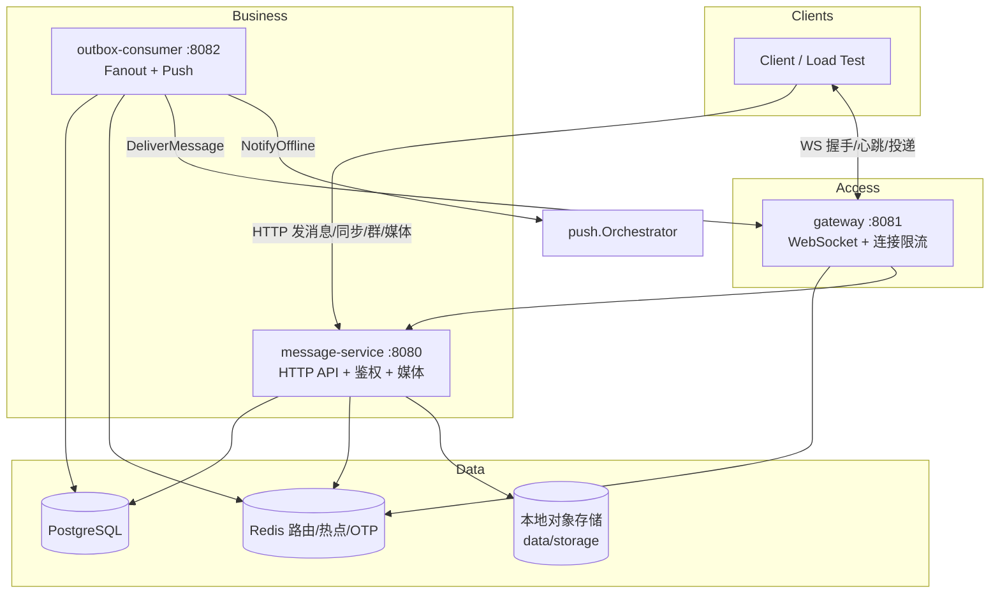
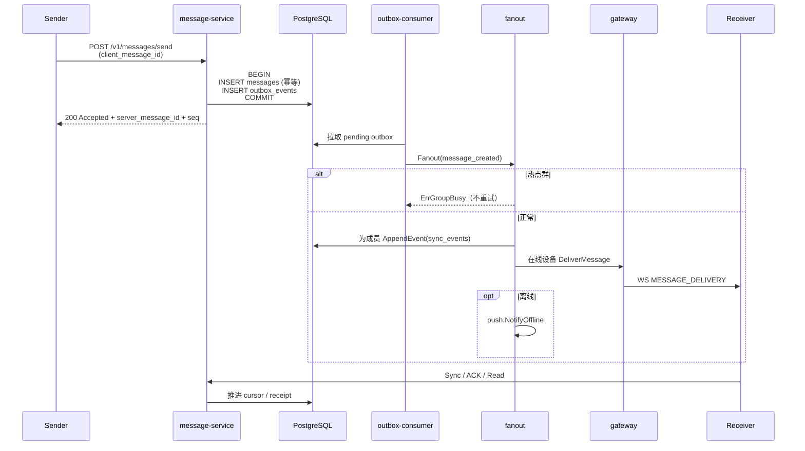

# LiveChat 架构设计总览

> **快速入口**：想 10 分钟搞清「系统长什么样、消息怎么走、高并发/IM 痛点怎么解」——读本文即可。  
> Phase 分册：[`livechat-server/docs/Phase1-架构设计说明.md`](../livechat-server/docs/Phase1-架构设计说明.md) · [`Phase2-架构设计说明.md`](../livechat-server/docs/Phase2-架构设计说明.md)  
> 规格源：[`Specs/`](../Specs/) · 术语：[`CONTEXT.md`](../CONTEXT.md) · 问题库：[`engineering-problems/`](./engineering-problems/)

## 1. 项目是什么

LiveChat 是**学习导向**的 WhatsApp 类即时通信系统：规格先行（`Specs/`），再落地 Go 服务端（`livechat-server/`）、压测（`load_test/`）、故障演练（`docs/chaos/`）。

**不是**商业 SLA 产品；容量数字（Spec 01）用于理解高负载取舍。

| 阶段 | 目标 | Ticket | 状态 |
|------|------|--------|------|
| Phase 1 | 消息正确性骨架（1:1 发送、实时投递、离线同步、已读） | 0001–0009 | complete |
| Phase 2 | 认证、群聊扇出、媒体、推送 | 0010–0015 | complete |
| Phase 3 | 安全基线、可观测、压测、混沌、缓存/iOS 骨架 | 0016–0021 | complete（学习闭环） |

## 2. 十分钟总览

### 2.1 运行时拓扑

三个长驻进程 + PostgreSQL + Redis：



| 进程 | 端口 | 职责边界 |
|------|------|----------|
| `message-service` | HTTP 8080 | 鉴权、发消息、会话/同步 API、群、媒体；**不**持有长连接 |
| `gateway` | WS 8081 | 握手、心跳、在线路由、实时推帧；**不**写消息业务语义 |
| `outbox-consumer` | metrics 8082 | 消费 `outbox_events` → Fanout（sync + 在线投递）→ 可选 Push |

### 2.2 模块地图（`livechat-server/internal/`）

| 包 | 一句话 |
|----|--------|
| `domain` | 共享类型与常量（Message / Attachment / 状态机词汇） |
| `api` | HTTP 路由与中间件 |
| `auth` | 两步 OTP、JWT、`session_version` 吊销 |
| `messages` | 幂等写入、会话内 `conversation_seq` |
| `outbox` | 同事务 Outbox + 消费者 lease/重试 |
| `fanout` | 成员解析、分级扇出、热点群 |
| `gateway` | Session、路由、重连退避、连接限流 |
| `sync` | `sync_events` / 游标 / 消息补拉 |
| `receipts` | 送达/已读收敛 |
| `conversations` / `group` | 会话列表投影、群成员与事件 |
| `media` | 分片上传、缩略图、HMAC 下载 |
| `push` | 离线推送决策与去重窗口 |
| `cache` / `metrics` / `traceutil` | 缓存抽象、指标、跨服务 trace |

## 3. 主链路：一条消息如何「正确」到达



**必须记住的分层语义（工程问题 06）：**

| 阶段 | 含义 | 不等于 |
|------|------|--------|
| Accepted | 服务端已持久化 | 对端已收到 |
| Delivered | 设备收到投递帧 / ACK | 用户已读 |
| Read | 已读位置单调推进 | 单条布尔已读 |

**顺序真相**：会话内只用 `conversation_seq`，不用墙上时钟排序（工程问题 02 / Spec 02）。

## 4. IM 常见痛点 → 本仓库怎么解

下表是「快速对照卡」：痛点 → 设计选择 → 代码/文档。

| # | 痛点 / 难点 | 解决方案（摘要） | 落地位置 |
|---|-------------|------------------|----------|
| 1 | 写库成功但投递丢失 | **Transactional Outbox**：messages + outbox 同事务 | `messages` + `outbox`；[问题 01](./engineering-problems/01-message-durability-outbox.md) |
| 2 | 弱网重试导致乱序/重复 | `client_message_id` 唯一约束 + 单点 SEQUENCE | `messages/service.go`；[问题 02](./engineering-problems/02-message-ordering-sequence.md) |
| 3 | 网关重启重连风暴 | 客户端指数退避+jitter；服务端 **IP/user 连接令牌桶** | `gateway/reconnect.go`、`ratelimit.go`；[问题 03](./engineering-problems/03-reconnection-storm.md) |
| 4 | 多端已读撕裂 | 服务端单源 unread + MAX 收敛 | `receipts` + summaries；[问题 04](./engineering-problems/04-multi-device-consistency.md) |
| 5 | 离线缺口补拉 | 全局 `sync_events` 游标 + 会话消息按需拉 | `sync`；[问题 05](./engineering-problems/05-offline-gap-detection.md) |
| 6 | 群写扩散打爆 DB | 小/中/大群分级；sync 仍写、summary/实时可降级 | `fanout/service.go`；[问题 10](./engineering-problems/10-group-fanout-write-amplification.md) |
| 7 | 热点群洪峰 | Redis 60s 滑动窗口 >50 → `ErrGroupBusy`，Consumer 不重试 | `fanout` + `outbox-consumer`；[chaos 06](./chaos/06-hot-group-flood.md) |
| 8 | 在线投递与推送重复 | Push 只做唤醒；真相在 sync；频控合并 | `push`；[问题 11](./engineering-problems/11-push-deduplication-coalescing.md) |
| 9 | 设备吊销 JWT 仍有效 | `session_version` claim vs DB 版本 | `auth` 中间件；[问题 08](./engineering-problems/08-session-version-device-revocation.md) |
| 10 | 媒体 URL 被盗链 | 成员校验 + HMAC 预签名 URL | `media`；[问题 13](./engineering-problems/13-download-url-hmac-signing.md) |
| 11 | Outbox 积压背压 | 可观测 pending/lag；演练暂停 Consumer（发送侧 429 仍为开放项） | [chaos 02](./chaos/02-outbox-backpressure.md)；[问题 15](./engineering-problems/15-high-concurrency-failure-modes.md) |
| 12 | 可观测性不足 | Histogram/metrics、trace 传播、告警与压测 | Spec 12；`metrics`/`traceutil`；`load_test/` |

### 4.1 高并发防护栈（分层）

```text
客户端          接入层              业务层               扇出层
─────────      ─────────────       ──────────           ────────────
退避+jitter →  IP/user 限流 →     幂等+SEQ单写点 →    分级扇出
               (ratelimit)         Outbox 耐久          热点 ErrGroupBusy
                                   (无发送侧 pending 反压 — 待学)
```

**数量级直觉**（Spec 01 学习假设，详见 [问题 15](./engineering-problems/15-high-concurrency-failure-modes.md)）：

- 200 人群 × 100 msg/s ≈ **2 万 sync_events/s**（放大因子先于「单接口 QPS」）
- 重连风暴：无 jitter 时握手尖峰 ≈ 连接数/秒；必须服务端限流，不能只靠客户端守规矩

### 4.2 验证手段（证明「方案真的生效」）

| 手段 | 路径 | 用途 |
|------|------|------|
| 单元/集成测试 | `livechat-server` `go test ./...` | 正确性回归 |
| 压测场景 | `load_test/`（send / connect / group_fanout / sync_backfill / reconnect_storm） | 吞吐与重连 |
| 故障演练 | `docs/chaos/01`–`06` + `livechat-server/scripts/chaos/` | 降级路径 |
| 差距基线说明 | `load_test/baselines/concurrency-gap-baseline.md` | 开放项与建议顺序 |

## 5. 存储与一致性边界

| 存储 | 存什么 | 一致性角色 |
|------|--------|------------|
| `messages` | 消息实体 + `conversation_seq` | 会话内顺序权威 |
| `outbox_events` | 待扇出事实 | 投递驱动；与 messages 同事务出现 |
| `sync_events` | 每用户事件流 | 离线/多端补拉权威 |
| `conversation_summaries` | 列表投影 | 可重建；中大群可降级更新 |
| Redis | WS 路由、OTP、热点窗口、部分缓存 | **可丢**：丢了则降级 sync / 重登 |
| 本地 FS / 未来对象存储 | 媒体二进制 | 元数据在 `attachments` |

**原则**：UI / Gateway / Message Service 不得各自发明状态；已读、未读、游标以服务端表为准（Spec 00 原则 3）。

## 6. 本地怎么跑

```bash
# 依赖：PostgreSQL :5432、Redis :6379（本机 brew；非强制 docker）
cd livechat-server
make migrate-up
make run-message-service   # :8080
make run-gateway           # :8081
make run-outbox-consumer   # :8082

make build && make test
```

压测（需服务已起）：

```bash
cd load_test
pip install -r requirements.txt
python run.py --quick --scenario send_message
```

## 7. 文档导航（按问题找材料）

| 你想… | 去读 |
|-------|------|
| 理解 Phase 1 正确性骨架细节 | `livechat-server/docs/Phase1-架构设计说明.md` |
| 理解认证/群/媒体/推送 | `livechat-server/docs/Phase2-架构设计说明.md` |
| 改设计前的规格 | `Specs/00`–`13`（主链路优先 02/04/05/06） |
| 某个工程坑的取舍 | `docs/engineering-problems/` |
| 演练故障 | `docs/chaos/` |
| 决策为什么选 A 不选 B | `docs/adr/` |
| 高并发开放学习项 | `docs/engineering-problems/adaptive-learning-roadmap.md` |

## 8. 明确「现在还没做 / 故意简化」的边界

避免把学习扩展误读为生产完备：

- 发送侧按 Outbox pending **反压 429** 尚未做  
- 幂等窗口缓存（DB unique 之前的积极去重）尚未做  
- 单机 Gateway：**无多节点 failover** 完整验证  
- 媒体 P0 为**本地文件系统**，非生产对象存储/CDN  
- 推送为 **mock APNs**，Push 不是消息载体  
- E2EE、音视频、全球分片等见 Spec 非目标  

开放项清单与推演见 [15-high-concurrency-failure-modes](./engineering-problems/15-high-concurrency-failure-modes.md)。
