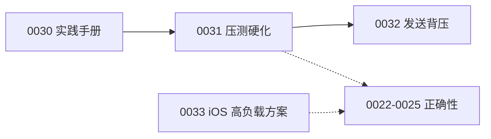

# 高性能 / 高负载 IM 验证推进计划

> 来源：Cursor plan `High-load IM validation`（2026-07-26）  
> 对应 issues：`0029`（父票）→ `0030`–`0033`  
> 相关已有票：`0019`/`0020`（压测与混沌骨架）、`0022`–`0028`（iOS 正确性）

## 目标定位

学习型容量假设（Spec 01：峰值连接 5万–20万、写入 1千–1万 msg/s）**不是**承诺生产 SLA。本地单机无法实证该量级；能做的是：把「放大因子 / 单写点 / 降级语义」用可控流量打出来并对照指标。

## 现状结论（审计摘要）

| 问题族 | 本仓现状 | 能否今天模拟 |
|--------|----------|--------------|
| 写扩散 / 热点群 | `fanout` 分级 + `ErrGroupBusy` | 是（`group_fanout` + chaos 06） |
| 重连风暴 | Gateway IP/user 限流已有；客户端退避未接 | 是（`reconnect_storm`，jitter 对照已实测） |
| Outbox 积压 | Consumer + **发送侧 429 背压（0032）** | 是（chaos 02 三阶段对照已实测） |
| 序号单写点 | SEQUENCE 串行 | 可压测观察延迟 |
| 缓存击穿 | `internal/cache` 未被业务引用 | 暂不能在热路径验证 |
| 多端一致 | sync API 已有 | 是（`sync_backfill` 已实装并实测） |

### iOS 双重定位

1. **负载源**：服务端容量验证的负载源 = Python `load_test/`，iOS 不负责打出千级 QPS。
2. **被测的高负载客户端**：iOS 本身必须能在大量历史消息、突发投递、弱网抖动、后台唤醒、写风暴下不卡 UI、不丢消息、不爆内存。本轮先落地方案与坑点（`0033`），实现由后续开票。

## 执行阶段与票映射

| 阶段 | Issue | 内容 | 状态 |
|------|-------|------|------|
| 父票 | [0029](../issues/0029-high-load-im-validation.md) | 高负载验证总览与门禁 | 进行中（服务端部分已完成） |
| A | [0030](../issues/0030-load-practice-playbook.md) | 业界实践模拟手册 | ✅ complete |
| B | [0031](../issues/0031-harden-load-test-chaos.md) | 压测 stub 硬化 + 基线 + chaos 04 | ✅ complete（[实测基线](../load_test/baselines/local-measured-baseline.md)） |
| C | [0032](../issues/0032-send-side-outbox-backpressure.md) | outbox pending → send 429 | ✅ complete（[对照演练](chaos/02-outbox-backpressure.md)） |
| D-1 | [0033](../issues/0033-ios-high-load-client-design.md) | iOS 高负载/弱网方案与坑点 | ✅ complete |
| D-2 | 0022–0028 | 多端正确性（已开票） | 待做：0022→0026∥→0023→0025 |

### 本轮实测得到的三个结论

1. **本机最先撞到的不是数据库，而是 Gateway 接入限流**（每 IP 5 conn/s）。单 IP 压测无法外推连接容量。
2. **重连 jitter 直接决定恢复成功率**：500ms jitter 下 2/10 成功，无 jitter 0/10 全被拒。
3. **发送侧背压把积压封了顶**：暂停 consumer 后 95.2% 发送返回 429，pending 停在 88 而非无限增长，恢复后自动放行。

## 阶段要点

### A — 业界实践模拟手册（0030）

路径建议：`docs/load-practice/`。统一模板：问题 → 业界方案 → 本仓现状 → 如何模拟 → 观察指标 → 通过标准。最少覆盖 8 条：写高峰、热点群、重连风暴、Outbox 背压、Redis 降级、DB 暂停、Gateway kill、离线 sync 积压。

### B — 压测/演练硬化（0031）

- 补齐 `connect` / `sync_backfill` stub；加固 `send_message`；`group_fanout` 可配置成员数
- 跑本机基线写入 `load_test/baselines/`
- chaos 04 补最小 push 延迟/失败注入

### C — 发送侧背压（0032）

`outbox_pending`（或 lag）超阈 → `POST /v1/messages/send` 返回 429 + Retry-After；更新手册做有/无背压对照。

### D-1 — iOS 高负载方案（0033）

产出 `docs/ios-high-load-client.md`。覆盖：突发投递刷新、大会话滚动、发送写风暴、GRDB 写并发、弱网、重连、后台预算、sync 洪流、图片内存、序号排序。**不写实现代码**。

### D-2 — iOS 正确性（已有 0022–0028）

高负载要求作为横切验收项，后续可补进 0023/0024/0025。

## 验收口令（学习型）

- Python：`--quick` 五场景绿 + 一份填数基线 + 至少 2 个 chaos 复盘
- iOS 正确性：双端收发文本成功（WS 或 sync）
- iOS 高负载（方案落地后）：首屏大会话不卡主线程、弱网发送不丢、突发投递不掉帧
- **不**把「打满 Spec 01 数字」列为门禁

## 明确不做（本轮）

- 用 iOS 模拟器集群打容量
- 本地宣称达到 Spec 01 峰值连接/写入
- 一次性实现缓存全链路、多 Gateway 生产 failover、真 APNs 压测

## 文档导航

- [架构设计总览](架构设计总览.md)
- [load-practice 实践手册](load-practice/README.md)（0030）
- [iOS 高负载/弱网方案](ios-high-load-client.md)（0033）
- [engineering-problems/15 高并发失效模式](engineering-problems/15-high-concurrency-failure-modes.md)
- [chaos 手册](chaos/README.md)
- [iOS 多端接入评估](iOS多端接入评估与实现.md)
- [Spec 01 产品边界与 SLO](../Specs/01-产品边界与SLO.md)
