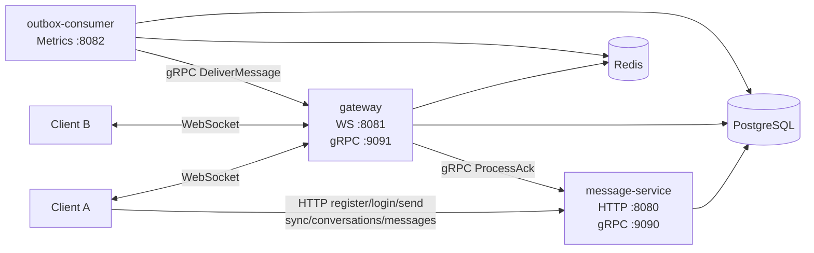
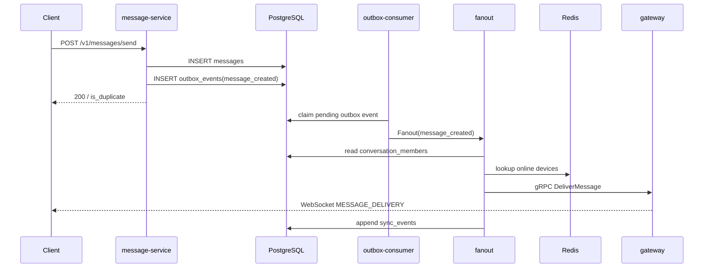
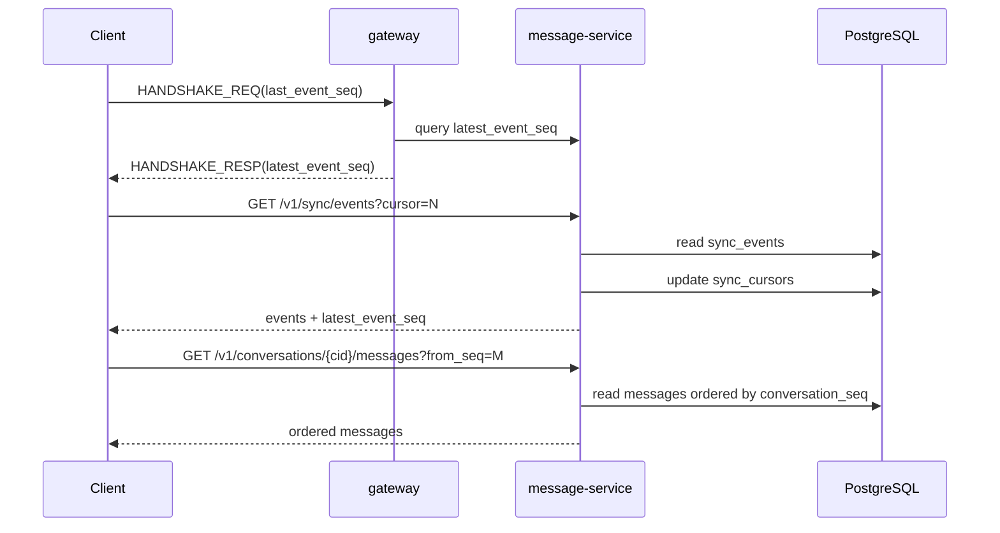
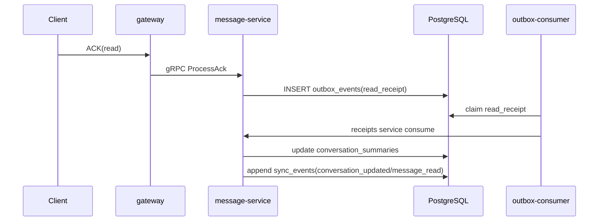

# Phase 1 架构设计说明

本文档只说明 **Phase 1 已经实现的服务端架构**，用于帮助理解当前 `livechat-server/` 的真实实现边界、核心链路和关键技术决策。

本文档不描述 Phase 2 的目标能力，不把 `0010-0015` 的未来设计混入当前实现。

## 1. 文档目标

这份文档回答 4 个问题：

1. 当前系统由哪些进程组成，各自负责什么
2. 当前消息发送、实时投递、离线同步、已读收敛是如何串起来的
3. 为什么当前架构要这样分层，而不是采用更省事的临时写法
4. 当前阶段明确没有做什么，避免把未来设计误读为现状

## 2. 当前范围

当前仓库已经完成：

- Phase 1 的父级目标 `0001`：消息正确性骨架
- Phase 1 的子票 `0002-0009`

当前仓库尚未开始：

- Phase 2 的 `0010-0015`

因此，本文档描述的是一套**已经可以运行、已经具备固定测试和 runbook 证据的 1:1 IM 服务端骨架**。

## 3. 架构总览

### 3.1 运行时拓扑

### 3.2 三个核心进程

#### `message-service`

职责：

- 提供认证、发消息、同步、会话列表、消息补拉 HTTP API
- 持久化 `messages`
- 同事务写入 `outbox_events`
- 提供 `MessageAckService.ProcessAck` gRPC 服务
- 管理 `sync_events`、`sync_cursors`
- 驱动 `conversation_summaries` 的业务投影

对应入口：

- [main.go](file:///Users/apple/Developments/LiveChat/livechat-server/cmd/message-service/main.go)

#### `gateway`

职责：

- 提供 WebSocket 连接接入
- 做 JWT 握手校验
- 管理 Session 生命周期
- 维护心跳和 watchdog
- 维护 Redis 路由
- 把客户端 ACK 通过 gRPC 转发给 `message-service`
- 接收来自 `outbox-consumer` 的 gRPC 实时投递请求，并转成 WebSocket 帧

对应入口：

- [main.go](file:///Users/apple/Developments/LiveChat/livechat-server/cmd/gateway/main.go)

#### `outbox-consumer`

职责：

- 轮询 `outbox_events`
- 原子领取待处理事件
- 做 worker pool 并发消费
- 处理重试、退避、死信、stale processing 接管
- 调用 `fanout` 和 `receipts` 领域服务

对应入口：

- [main.go](file:///Users/apple/Developments/LiveChat/livechat-server/cmd/outbox-consumer/main.go)

## 4. 分层原则

当前实现有 3 条强约束。

### 4.1 Gateway 只处理连接和协议

Gateway 不直接写消息表、不直接推进已读状态、不直接维护会话摘要。

它只负责：

- 握手
- 心跳
- 路由
- 帧解析与转发
- 把 ACK 上送到业务层

这样做的原因是：连接层和业务层必须分离，否则状态定义会在多个服务中漂移。

### 4.2 Message Service 是业务真相源

消息写入、已读推进、同步事件、会话摘要都以 `message-service` 中的数据库状态为准。

这意味着：

- 实时投递不是最终真相
- WebSocket 收到消息也不等于系统状态已经完成
- 真正的可补拉事实来源是 `sync_events`

### 4.3 Outbox 是跨进程一致性的桥

当前实现没有采用“写消息成功后直接函数调用 fanout”的方式，而是：

1. 先写 `messages`
2. 同事务写 `outbox_events`
3. 再由 `outbox-consumer` 异步消费

这样可以避免两类典型错误：

- 消息已落库，但永不投递
- 投递事件已产生，但消息根本不存在

## 5. 核心存储模型

### 5.1 PostgreSQL

当前 PostgreSQL 主要承担四类状态：

- 消息事实：`messages`
- 异步事件桥：`outbox_events`
- 离线同步事实：`sync_events`、`sync_cursors`
- 会话投影：`conversation_summaries`

还包括：

- `users`
- `devices`
- `conversations`
- `conversation_members`

### 5.2 Redis

当前 Redis 只承担运行时路由，不承担业务真相。

关键 key：

- `gateway:user:{user_id}:{device_id}`
- `gateway:node:{node_id}:connections`
- `gateway:node:{node_id}:heartbeat`

Redis 中的数据可以丢失、可以过期，因为它的职责只是帮助找到在线连接。真正的补偿仍由 `sync_events` 完成。

## 6. 流程描述

### 6.1 发消息主链路

关键点：

- `messages` 与 `outbox_events` 同事务写入
- `sync_events` 是所有接收方都会得到的事实记录
- 实时投递只是在线设备的加速路径

### 6.2 离线同步链路

关键点：

- `latest_event_seq` 用于判断是否存在离线差量
- `sync_cursors` 只前进，不回退
- 会话消息补拉使用 `conversation_seq` 升序返回

### 6.3 已读回执链路

关键点：

- Gateway 不直接推进已读
- 已读先变成业务 outbox 事件，再进入统一消费链路
- 多端收敛规则是 `MAX(last_read_seq)`

## 7. 当前代码结构与职责映射

### 7.1 `internal/messages`

核心职责：

- 校验发送者是否为会话成员
- 分配 `conversation_seq`
- 处理幂等 `client_message_id`
- 同事务写入 `messages` 与 `outbox_events`

关键实现：

- [service.go](file:///Users/apple/Developments/LiveChat/livechat-server/internal/messages/service.go)

### 7.2 `internal/fanout`

核心职责：

- 解析 `message_created` 事件
- 查询会话成员
- 为接收方追加 `sync_events`
- 根据 Redis 路由做在线实时投递

关键实现：

- [service.go](file:///Users/apple/Developments/LiveChat/livechat-server/internal/fanout/service.go)

### 7.3 `internal/receipts`

核心职责：

- 接收 `ACK(read)` 业务语义
- 先入 `read_receipt` outbox
- 再由消费者驱动已读投影
- 生成 `conversation_updated` 和 `message_read`

关键实现：

- [service.go](file:///Users/apple/Developments/LiveChat/livechat-server/internal/receipts/service.go)

### 7.4 `internal/outbox`

核心职责：

- 轮询待处理事件
- 原子 claim 事件
- 并发消费
- 指数退避 + jitter
- 失败转 `failed`
- stale processing 接管

### 7.5 `internal/gateway`

核心职责：

- 握手与 Session 建立
- WebSocket 帧编解码
- 心跳与 watchdog
- Redis 路由注册 / 续租 / 清理
- ACK 转发
- 实时消息下发

### 7.6 `internal/sync`

核心职责：

- 追加 `sync_events`
- 维护 `sync_cursors`
- 提供增量读取
- 提供 `latest_event_seq`

## 8. 当前已经落地的协议与契约

### 8.1 对外 HTTP

当前 Phase 1 已实现的主要 HTTP API：

- `POST /v1/auth/register`
- `POST /v1/auth/login`
- `POST /v1/messages/send`
- `GET /v1/sync/events`
- `GET /v1/conversations`
- `GET /v1/conversations/{cid}/messages`
- `GET /health`

### 8.2 对外 WebSocket

当前 Phase 1 已实现的核心 opcode：

- `HANDSHAKE_REQ`
- `HANDSHAKE_RESP`
- `HEARTBEAT`
- `HEARTBEAT_ACK`
- `ACK`
- `ERROR`
- `DISCONNECT`
- `MESSAGE_DELIVERY`

### 8.3 内部 gRPC

当前 Phase 1 已实现的内部强契约：

- `MessageAckService.ProcessAck`
- `GatewayDeliveryService.DeliverMessage`

## 9. 关键技术决策

### 9.1 为什么不用单体同步调用

如果发送消息时直接在 HTTP handler 里查在线状态、直接推 WebSocket，会出现两个问题：

- 写库成功但推送失败时，状态难以补偿
- 业务 handler 会同时承担持久化、投递、重试、离线同步，复杂度过高

所以当前架构坚持：

- 写路径先完成持久化
- 跨进程动作交给 Outbox

### 9.2 为什么实时投递和离线同步要并存

因为它们解决的是两件不同的事：

- 实时投递解决“在线时尽快看到消息”
- 离线同步解决“断线、多端、补拉、一致性”

如果只做实时投递，断线恢复会丢事实。
如果只做离线同步，在线体验会明显退化。

### 9.3 为什么已读必须走业务层

已读不是网络层事件，而是业务语义。

它会影响：

- `conversation_summaries.unread_count`
- 其他设备的 `conversation_updated`
- 对端的 `message_read`

因此 ACK 不能在 Gateway 本地落库，必须回到业务服务统一处理。

### 9.4 为什么 Phase 1 不引入 Kafka / CDC

因为当前阶段目标是建立正确性骨架，不是吞吐上限。

P0 先用 PostgreSQL + Outbox + 轮询做对，再考虑 Phase 2/后续阶段是否需要更重的基础设施。

## 10. 当前非目标

以下内容不属于当前架构实现范围：

- 群聊成员管理与群消息扇出
- 图片消息上传、下载、缩略图
- 推送通知与后台唤醒
- 连接迁移（WiFi 到蜂窝）
- 端到端加密

这些能力已经拆到 `0010-0015`，但当前代码并未实现。

## 11. 推荐阅读顺序

如果要把“文档、架构、代码”三者连起来，建议按这个顺序读：

1. [阶段性实现介绍.md](file:///Users/apple/Developments/LiveChat/livechat-server/docs/阶段性实现介绍.md)
2. [Phase1-架构设计说明.md](file:///Users/apple/Developments/LiveChat/livechat-server/docs/Phase1-架构设计说明.md)
3. [technical-decisions.md](file:///Users/apple/Developments/LiveChat/livechat-server/docs/technical-decisions.md)
4. [main.go](file:///Users/apple/Developments/LiveChat/livechat-server/cmd/message-service/main.go)
5. [main.go](file:///Users/apple/Developments/LiveChat/livechat-server/cmd/gateway/main.go)
6. [main.go](file:///Users/apple/Developments/LiveChat/livechat-server/cmd/outbox-consumer/main.go)

## 12. 当前结论

Phase 1 当前已经实现的是一套以 **PostgreSQL + Redis + Go 三进程** 为基础、以 **Outbox 模式 + gRPC/Protobuf 强契约** 为核心边界、以 **WebSocket 实时投递 + `sync_events` 离线补拉** 为一致性机制的 1:1 IM 服务端骨架。

这套骨架的价值不在于“功能已经很多”，而在于：

- 写路径有单一真相源
- 跨进程链路有强契约
- 在线与离线路径已清晰分层
- 已读和多端收敛已进入统一业务语义
- 关键链路已有自动化测试和 runbook 固定证据
