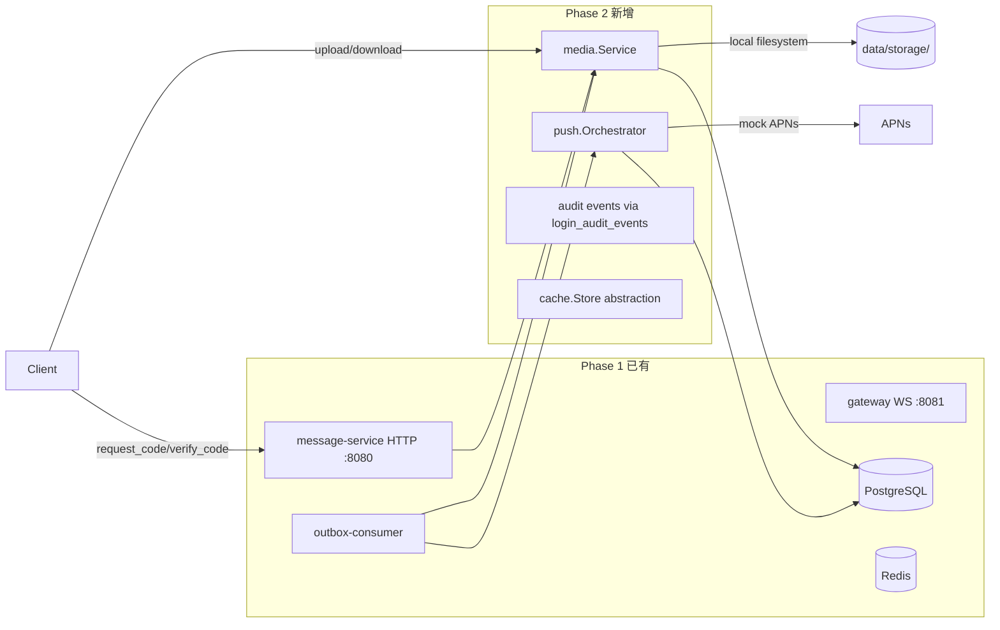

# Phase 2 架构设计说明

本文档只说明 **Phase 2 已经实现的服务端架构**，覆盖 ticket 0011-0015：认证收敛、设备会话管理、群 CRUD 与事件投影、群消息扇出分级策略、图片媒体上传下载、推送编排。

本文档不描述 Phase 1 的基础设施（见 [`Phase1-架构设计说明.md`](./Phase1-架构设计说明.md)），不把 Phase 3 的未来设计混入当前实现。

## 1. 文档目标

这份文档回答 4 个问题：

1. Phase 2 在 Phase 1 的基础上增加了哪些能力，各自如何工作
2. 认证从"单步注册"升级到"两步认证"后的完整链路
3. 群聊从"有成员没投递"到"分级扇出+热点保护"的架构演进
4. 图片上传和推送编排不阻塞消息主链路的隔离策略

## 2. 当前范围

当前仓库已经完成：

- Phase 2 的父级目标 `0010`：用户可感知能力
- Phase 2 的子票 `0011-0015`

## 3. 架构总览

### 3.1 Phase 2 新增的模块边界



**新增的运行时依赖：**

| 模块 | 文件 | 职责 |
|------|------|------|
| `internal/media/` | `service.go` | 上传凭证签发、分片管理、缩略图生成、下载授权 |
| `internal/push/` | `orchestrator.go` | 推送决策树、频控窗口、Badge 计算、APNs 接口（mock） |
| `internal/cache/` | `cache.go`, `redis.go`, `memory.go`, `noop.go` | 通用缓存抽象层（P1） |
| `internal/group/` | `service.go`（已扩展） | 群 CRUD + LeaveGroup + group_events 投影 + sync_events 写入 |
| `internal/fanout/` | `service.go`（已扩展） | 群成员枚举、分级扇出、热点群检测 |

**Phase 1 已有模块的变更：**

| 模块 | 变更 |
|------|------|
| `internal/auth/` | Claims 新增 SessionVersion、SignAccessToken 改为 3 参数 |
| `internal/api/router.go` | 新增 5 个端点（request_code、verify_code、push-token、leave、media）、中间件加入 session_version 检查、安全头中间件 |
| `migrations/` | 新增 011_auth_convergence（session_version + login_audit_events） |
| `internal/domain/types.go` | Device 新增 SessionVersion、AuditEvent 结构体、审计事件常量 |
| `internal/traceutil/` | 新增 SpanID、gRPC metadata 传播 |
| `cmd/outbox-consumer/` | fanout.ErrGroupBusy 非重试处理 |

## 4. 认证链路（0011）

### 4.1 从"单步注册"到"两步认证"

**Phase 1（已废弃但仍可用）：**
```
POST /v1/auth/register {phone, code, device_id} → 直接返回 JWT
```

**Phase 2（新标准流程）：**
```
POST /v1/auth/request_code {phone}
  → Redis SET "code:{phone}" = "123456" EX 300
  → 频控: phone 维度 ≤3/h, IP 维度 ≤20/h
  ← {retry_after_sec: 30, expires_in_sec: 300}

POST /v1/auth/verify_code {phone, code, device_id, platform}
  → Redis GET/DEL "code:{phone}"  // 一次性使用
  → UPSERT users (首次自动创建)
  → UPSERT devices (bump session_version)
  → INSERT login_audit_events
  → SignAccessToken(userID, deviceID, sessionVersion)
  ← {access_token, refresh_token, user_id, device_id}
```

### 4.2 session_version 吊销机制

**为什么需要：** JWT 是无状态的，签发后在有效期内（1h）持续可用。用户吊销设备时要立即拒绝旧 JWT。

**方案：** JWT 携带 `sv` claim，中间件每次请求对比 DB 中的当前版本。

```
JWT Claims: {user_id: 1, device_id: "ios-abc", sv: 3}
devices 表: {id: "ios-abc", session_version: 5}  ← 已被吊销 2 次

中间件: claims.sv(3) < db.session_version(5) → 401 device_revoked
```

**版本号递增时机：**
- 用户主动吊销（`POST /v1/devices/{did}/revoke`）
- Refresh Token 轮换（每次刷新 +1）
- 重新登录同一设备（每次 verify_code +1）

### 4.3 审计事件

所有安全关键操作写入 `login_audit_events`：
- `login_success` / `login_failed`
- `code_request`
- `device_added` / `device_revoked`
- `token_refreshed` / `token_replay_detected`
- `security_alert`

**存储策略：** P0 同步写入（审计量小），P1 可改为 buffered channel 异步写入。

## 5. 群聊链路（0012 + 0013）

### 5.1 群数据模型

```
groups ─────────────► group_members (active: left_at IS NULL)
   │                       │
   │  creator_user_id      │  role: owner / admin / member
   │  max_members (200)     │  joined_at, added_by
   │  current_members       │  left_at (soft delete)
   │                       │
   └──► group_events ──────┘  event_type: created / member_joined /
        (审计日志)                member_left / member_removed
```

**群与会话的关系：**
- 每个群对应一个 `conversation`（`type = 'group'`）
- `conversation_id = "conv_" + group_id`（如 `conv_grp_123_456`）
- 成员资格通过 `group_members.left_at IS NULL` 判断
- `conversation_members` 在成员退出时同步删除

### 5.2 成员变更 → sync_events 投影

```
CreateGroup:
  INSERT groups + conversation + group_members(owner) + conversation_members
  → group_events: "created"
  → conversation_summary 初始化（创建者）

AddMembers:
  INSERT/UPDATE group_members + INSERT conversation_members
  → group_events: "member_joined" (每人一条)
  → conversation_summary 初始化（新成员）
  → sync_events: 对所有活跃成员 + 操作者写入 "member_joined"

RemoveMember / LeaveGroup:
  UPDATE group_members SET left_at = NOW()
  DELETE conversation_members
  → group_events: "member_removed" / "member_left"
  → conversation_summary SET is_hidden = true（被移出/退群者）
  → sync_events: 对所有成员 + 被移出者写入事件
```

### 5.3 群消息扇出：三级策略

```go
// internal/fanout/service.go
func (s *Service) resolveTargets(ctx, conversationID, senderUserID) []int64 {
    // 优先查 group_members（active）
    rows := db.Query("SELECT user_id FROM group_members
                      WHERE group_id=$1 AND left_at IS NULL AND user_id != $2")
    if len(rows) > 0 { return rows }

    // Fallback: conversation_members（1:1 场景）
    rows := db.Query("SELECT user_id FROM conversation_members
                      WHERE conversation_id=$1 AND user_id != $2")
    return rows
}
```

| 群规模 | 策略 | 在线投递 | sync_events | conversation_summary |
|-------|------|---------|-------------|---------------------|
| direct / ≤50 人 | 全写扩散 | ✅ 实时 | ✅ 所有成员 | ✅ 更新 |
| 51-200 人 | 混合 | ✅ 实时 | ✅ 所有成员 | ❌ 不更新（按需计算） |
| >200 人 | 纯读扩散 | ❌ | ✅ 仅写入 | ❌ |

### 5.4 热点群保护

```
判定: 60s 滑动窗口内消息 > 50 条 → hot_group:{gid} (Redis Sorted Set)
Fanout: ZCARD > 50 → return ErrGroupBusy
Outbox Consumer: err == ErrGroupBusy → return nil（不重试，消息不丢）
恢复: 窗口内消息 < 50 → 自动恢复正常投递
```

**热点群的降级语义：**
- 消息已在 `messages` 表中持久化（不会丢）
- 实时投递被跳过（`ErrGroupBusy`）
- 客户端通过 `GET /v1/sync/events` 补拉

## 6. 图片媒体链路（0014）

### 6.1 上传-处理-下载全链路

```
Client                  Media Service              ObjectStore
  │                          │                          │
  │ POST /media/upload/initiate                         │
  │─────────────────────────►│                          │
  │                          │ InitiateMultipartUpload  │
  │                          │─────────────────────────►│
  │ {upload_id, presigned_urls[], object_key}           │
  │◄─────────────────────────│                          │
  │                          │                          │
  │ PUT part_1 (直传)       │                          │
  │────────────────────────────────────────────────────►│
  │ PUT part_2              │                          │
  │────────────────────────────────────────────────────►│
  │                          │                          │
  │ POST /media/upload/{upload_id}/complete             │
  │─────────────────────────►│                          │
  │                          │ CompleteMultipartUpload  │
  │                          │─────────────────────────►│
  │                          │                          │
  │                          │ [异步] GenerateThumbnail  │
  │                          │   GetObject → resize     │
  │                          │   → PutObject(thumb)     │
  │                          │   → UPDATE attachments   │
```

### 6.2 ObjectStore 抽象

```go
type ObjectStore interface {
    InitiateMultipartUpload(ctx, key, contentType) (uploadID, error)
    PresignUploadPart(ctx, key, uploadID, partNumber, expires) (url, error)
    CompleteMultipartUpload(ctx, key, uploadID, parts) error
    GetObject(ctx, key) ([]byte, error)
    PutObject(ctx, key, data, contentType) error
    PresignDownload(ctx, key, expires) (url, error)
}
```

**P0 实现：** `LocalObjectStore` — 本地文件系统（`data/storage/`）
**P1 替换：** MinIO / S3 — 只需换实现，接口不变

### 6.3 缩略图生成

```
GenerateThumbnail(objectKey):
  raw := store.GetObject(objectKey)
  img := image.Decode(raw)
  resized := 320px 等比例缩放 (ApproxBiLinear)
  buf := jpeg.Encode(resized, quality=80)
  store.PutObject(thumbKey, buf, "image/jpeg")
  UPDATE attachments SET thumbnail_key = thumbKey, upload_status = 'complete'
```

**故障处理：** 生成失败 → `upload_status = 'failed'` → 不影响消息本身可见

### 6.4 授权下载

```
POST /v1/media/download/auth {object_key, conversation_id}
  → 校验: 请求者是 conversation 成员
  → 生成 presigned URL (HMAC-SHA256 签名, 1h 有效)
  ← {download_url, expires_in_sec, content_type, content_length}
```

## 7. 推送编排链路（0015）

### 7.1 推送决策树

```
消息投递完成 → 目标设备 online?
  ├─ Yes → WebSocket 直接投递 → 不推送
  └─ No  → 设备有 push_token?
            ├─ No  → 仅写 sync_events → 等客户端上线拉取
            └─ Yes → 频控窗口检查
                      ├─ 30s 内同会话已有 visible push → 合并（计数+1），不发送
                      ├─ 30s 内同会话已有 silent push → 升级为 visible push
                      └─ 无历史 → 发送 silent push（优先低功耗）
```

### 7.2 频控窗口

```
Redis Key: push_window:{user_id}:{conversation_id}
Value: {push_type, last_push_at_ms, msg_count}
TTL: 30 seconds

静默群: 不发送 visible push（仍发送 silent push）
```

### 7.3 Mock APNs

```go
type APNsClient interface {
    Send(ctx, deviceToken, payload) (apnsID, status, error)
}

// P0: MockAPNsClient — 总是返回 sent，记录日志
// P1: 替换为真实 HTTP/2 APNs client
```

### 7.4 Badge 计算

```sql
SELECT COALESCE(SUM(unread_count), 0)
FROM conversation_summaries
WHERE user_id = $1 AND is_hidden IS FALSE
```

每次推送时计算，写入 `aps.badge`。

## 8. 关键技术决策

| 决策 | 选择 | 原因 | 位置 |
|------|------|------|------|
| 验证码存储 | Redis `code:{phone}` TTL 5min | 不用 JWT 携带（安全），不用 DB（高频读写） | `router.go:handleRequestCode` |
| 设备吊销 | session_version（DB 查询） | P0 不引入 Redis 缓存（devices 表很小） | `router.go:middleware` |
| 群成员来源 | `group_members`（非 `conversation_members`） | 退出成员从 conversation_members 删除，但群消息应发给"当时在群内的人" | `fanout/service.go:resolveTargets` |
| 热点群检测 | Redis Sorted Set 滑动窗口 | ZCARD 近似即可，不需要精确原子操作 | `fanout/service.go:isHotGroup` |
| 对象存储 | LocalObjectStore（文件系统） | P0 零外部依赖；接口化设计，切换只需换实现 | `media/service.go:ObjectStore` |
| 推送 | MockAPNsClient | P0 不连 Apple 服务器；payload 结构已对齐 APNs | `push/orchestrator.go:APNsClient` |
| 审计 | 同步写入 login_audit_events | 审计量小（登录/吊销/刷新），异步优化放 P1 | `router.go:handleVerifyCode` |
| 安全头 | 中间件层统一注入 | 所有响应自动携带 HSTS + X-Content-Type-Options + X-Frame-Options | `router.go:securityHeaders` |

## 9. Phase 2 明确没有做什么

- 没有实现 E2EE 密钥分发——消息在服务端明文存储
- 没有实现真实短信发送——Mock OTP 接受任意 6 位数字
- 没有实现 CDN 边缘分发——下载直回源 ObjectStore
- 没有实现 APNs 真实调用——Mock 返回成功
- 没有实现视频转码——仅支持 JPEG/PNG/WebP 图片缩略图
- 没有实现 RS256 JWT——继续使用 HMAC-SHA256
- 没有拆库分片——单库单表

这些是 Phase 3+ 或 P1 扩展的边界。
